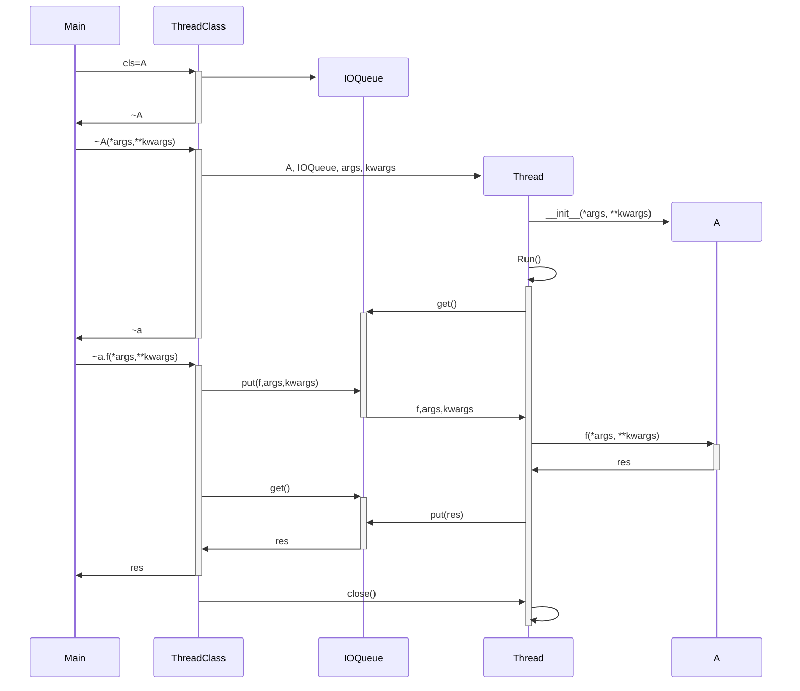
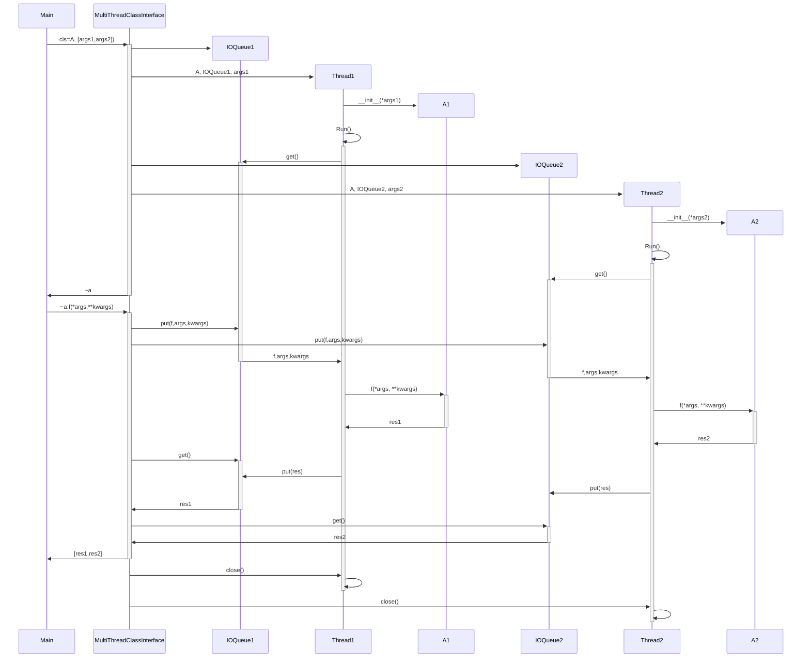
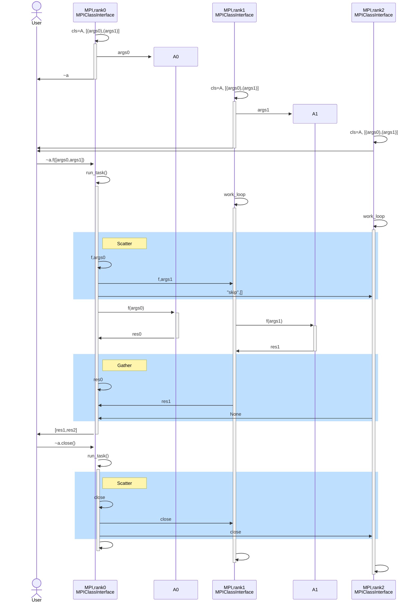
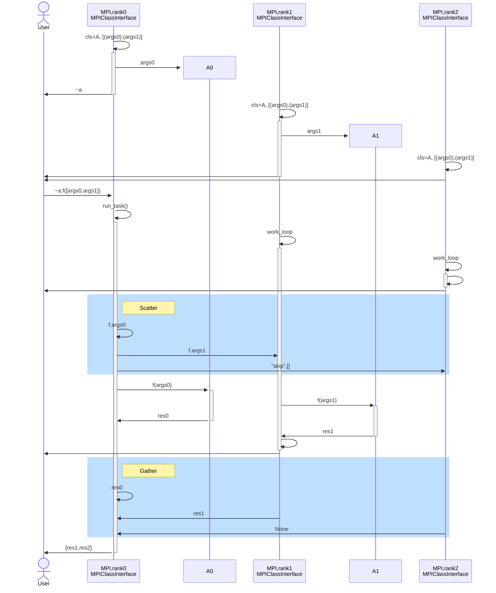
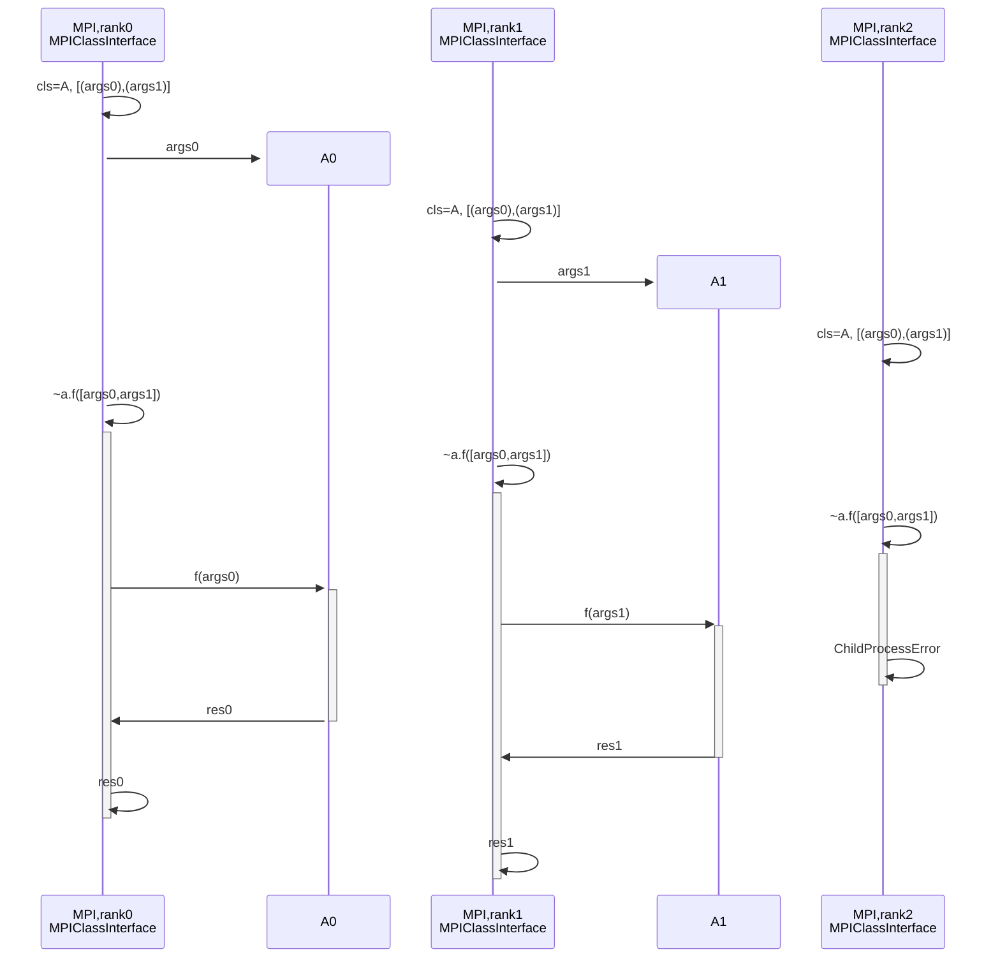

# Sequence diagrams
- [ThreadClass](#threadclass)
- [ProcessClass](#processclass)
- [MultiThreadClassInterface](#multithreadclassinterface)
- [MultiProcessClassInterface](#multiprocessclassinterface)
- [MPIClassInterface](#mpiclassinterface)
- [MPIClassInterface(LOOP_UNTIL_CLOSE=False)](#mpiclassinterfaceloop_until_closefalse)
- [MPIClassInterface(COLLECTIVE_MPI=False)](#mpiclassinterfacecollective_mpifalse)

## ThreadClass

## ProcessClass

The `ProcessClass` is similar to the `ThreadClas` except that it uses a seprate Process instead of a Thread.
This means:
- More time used to spawn process
- Changes to `os.environ['LD_LIBRARY_PATH']` are effective in the process
- Libraries (dll/so) will have their own memory space (important if multiple instances are launched)
- Multiple processes allows parallel execution

## MultiThreadClassInterface

## MultiProcessClassInterface

The `MultiProcessClassInterface` is similar to the `MultiThreadClassInterfaces` except that it uses a seprate processes instead of a threads.
This means:
- More time used to spawn processes
- Changes to `os.environ['LD_LIBRARY_PATH']` are effective in the processes
- Libraries (dll/so) executed in the processes will their own individual memory space (changes to a variable in one dll does not affect the others)
- Parallel execution of class functions

## MPIClassInterface

## MPIClassInterface(LOOP_UNTIL_CLOSE=False)

Setting `mpi_interface.LOOP_UNTIL_CLOSE=False` results in the following workflow

## MPIClassInterface(COLLECTIVE_MPI=False)
Setting `mpi_interface.COLLECTIVE_MPI=False` results in the following workflow

