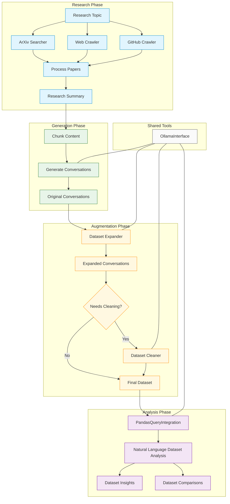

<p align="center">
  
</p>
<p align="center">
  <a href="https://ko-fi.com/theborch"></a>
  <a href="https://discord.gg/dAzSYcnpdF"></a>
</p>

# Agent Chef

Agent Chef is a comprehensive Python package that leverages the UDRAGS (Unified Dataset Research, Augmentation, & Generation System) framework to streamline the creation, augmentation, and analysis of conversation datasets for AI training and research.

## Overview

Agent Chef provides an end-to-end solution for:

- Researching topics from multiple sources (ArXiv, web search, GitHub repositories)
- Generating high-quality conversation datasets
- Expanding and augmenting existing datasets
- Analyzing and cleaning data to ensure quality
- Querying and analyzing datasets using natural language

Built on top of local Ollama models, Agent Chef enables researchers and developers to work with conversation data efficiently without requiring external API access.

## Features

- **Multi-source Research Pipeline**: Extract content from ArXiv papers, web searches, and GitHub repositories
- **Conversation Generation**: Create realistic and varied conversations from research papers and other content
- **Dataset Expansion**: Paraphrase and expand datasets with controlled variations
- **NLP Hedging**: Generate nuanced responses with appropriate levels of confidence
- **Data Analysis**: Query and analyze datasets using natural language with PandasQueryEngine integration
- **Dataset Cleaning**: Identify and fix quality issues in expanded conversation datasets
- **Easy-to-use UI**: Simple graphical interface for managing the entire workflow

## Installation

### Prerequisites

- Python 3.8+
- [Ollama](https://ollama.ai/) installed and configured with models of your choice

### Development Installation

```bash
# Clone the repository
git clone https://github.com/Leoleojames1/agentChef.git
cd agentChef

# Install dependencies
pip install -r requirements.txt

# Install in development mode
pip install -e .
```

### Future Installation (Coming Soon)

```bash
pip install agentChef
```

## Quick Start

```python
from agentChef.conversation_generator import OllamaConversationGenerator
from agentChef.dataset_expander import DatasetExpander

# Initialize conversation generator
generator = OllamaConversationGenerator(model_name="llama3")

# Generate a conversation about a topic
conversation = generator.generate_conversation(
    content="Attention mechanisms have become an integral part of compelling sequence modeling...",
    num_turns=3,
    conversation_context="AI research"
)

# Initialize dataset expander
# Simple Ollama interface wrapper
class OllamaInterface:
    def __init__(self, model_name="llama3"):
        self.model = model_name
        
    def chat(self, messages):
        import ollama
        return ollama.chat(model=self.model, messages=messages)

ollama_interface = OllamaInterface(model_name="llama3")
expander = DatasetExpander(ollama_interface, output_dir="./expanded_data")

# Expand the generated conversation
expanded_conversations = expander.expand_conversation_dataset(
    conversations=[conversation],
    expansion_factor=3,
    static_fields={'human': True, 'gpt': False}  # Keep human questions static
)

# Save the expanded conversations
expander.save_conversations_to_jsonl(expanded_conversations, "expanded_conversations")
```

## Command Line Interface

Agent Chef includes a comprehensive CLI for easy integration into workflows:

```bash
# Research a topic
python -m agentChef.udrags --mode research --topic "transformer models" --max-papers 5

# Generate conversations from research
python -m agentChef.udrags --mode generate --topic "transformer models" --turns 3 --expand 5 --clean

# Process existing papers
python -m agentChef.udrags --mode process --input papers_dir/ --format jsonl --expand 3
```

## Graphical User Interface

For a more interactive experience, Agent Chef provides a PyQt6-based UI:

```bash
python -m agentChef.udrags --mode ui
```

## Core Components

### OllamaConversationGenerator

Generate realistic conversations from text content using Ollama LLMs.

```python
generator = OllamaConversationGenerator(model_name="llama3", enable_hedging=True)

# Create a conversation about research content
conversation = generator.generate_conversation(
    content=paper_abstract,
    num_turns=3,
    conversation_context="research paper"
)
```

### PandasQueryIntegration

Natural language querying of pandas DataFrames using LlamaIndex and Ollama.

```python
from agentChef.pandas_query_integration import PandasQueryIntegration

# Create the query integration
pandas_query = PandasQueryIntegration(verbose=True)

# Query your DataFrame with natural language
result = pandas_query.query_dataframe(
    df, 
    "What's the average message length by participant type?"
)
```

### DatasetExpander

Expand existing conversation datasets by generating paraphrases and variations.

```python
# Initialize the expander
expander = DatasetExpander(ollama_interface, output_dir="./expanded_data")

# Expand a conversation dataset
expanded_conversations = expander.expand_conversation_dataset(
    conversations=original_conversations,
    expansion_factor=3,
    static_fields={'human': False, 'gpt': False}  # Make both dynamic
)
```

### DatasetCleaner

Clean and validate expanded datasets by comparing to originals and fixing quality issues.

```python
from agentChef.dataset_cleaner import DatasetCleaner

# Initialize the cleaner
cleaner = DatasetCleaner(ollama_interface, output_dir="./cleaned_data")

# Clean the expanded dataset
cleaned_conversations = cleaner.clean_dataset(
    original_conversations=original_conversations,
    expanded_conversations=expanded_conversations,
    cleaning_criteria={
        "fix_hallucinations": True,
        "normalize_style": True,
        "correct_grammar": True,
        "ensure_coherence": True
    }
)
```

## UDRAGS Process Flow

See the diagram below for the complete UDRAGS process workflow:



## Package Structure

```md
agentChef/
├── pyproject.toml
├── setup.py
├── LICENSE
├── README.md
├── agentChef/
│   ├── __init__.py
│   ├── udrags.py
│   ├── conversation_generator.py
│   ├── dataset_expander.py
│   ├── dataset_cleaner.py
│   ├── pandas_query_integration.py 
│   ├── crawlers_module.py
│   ├── ui_module.py
│   └── assets/
│       ├── Untitled-removebg-preview.png
│       ├── buy me a coffee button.png
│       └── Discord button.png
└── tests/
    ├── __init__.py
    ├── test_conversation_generator.py
    └── test_dataset_expander.py
```

## Contributing

Contributions are welcome! Please feel free to submit a Pull Request.

## License

MIT

## Acknowledgments

Agent Chef builds upon the UDRAGS framework and integrates with several open-source projects:
- Ollama for local LLM access
- LlamaIndex for natural language querying of structured data
- PyQt6 for the graphical user interface
