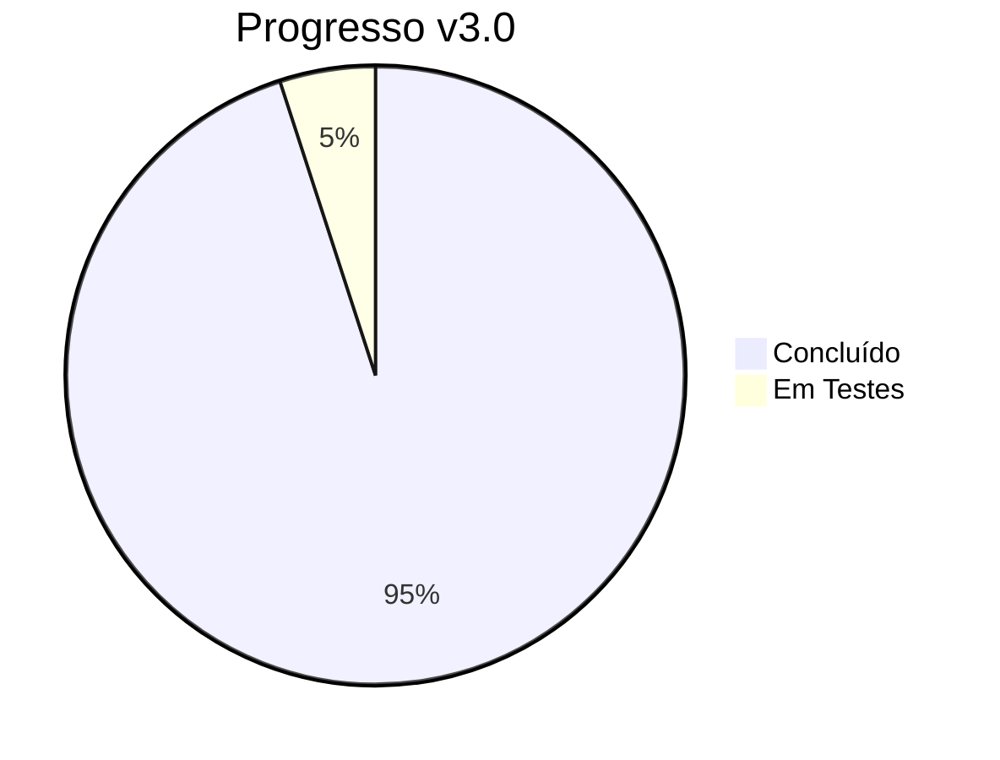
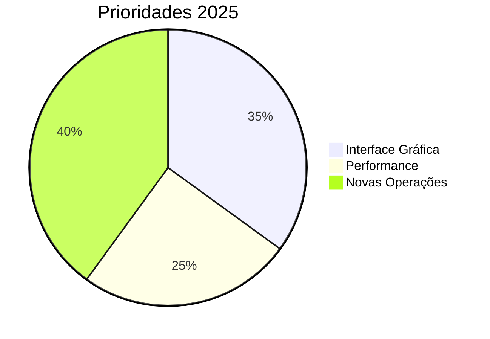
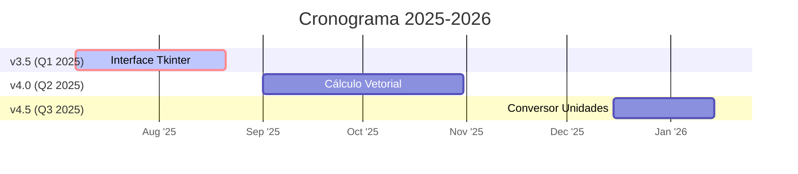
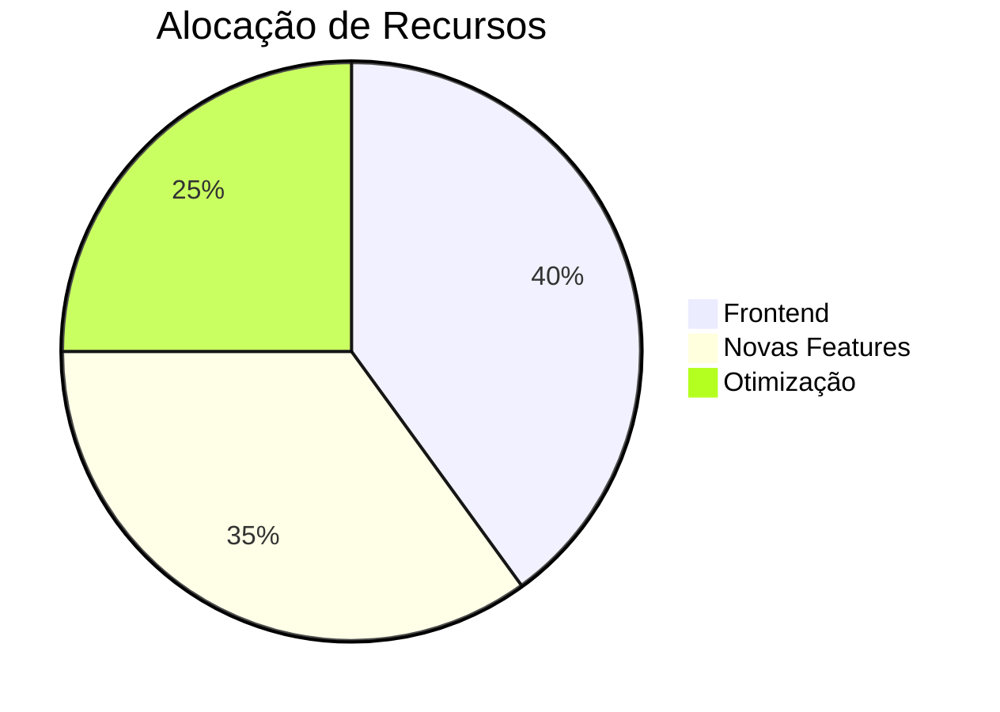
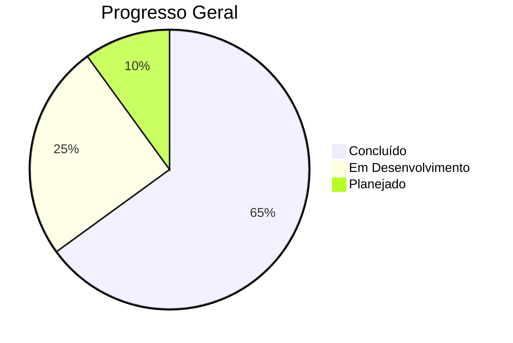
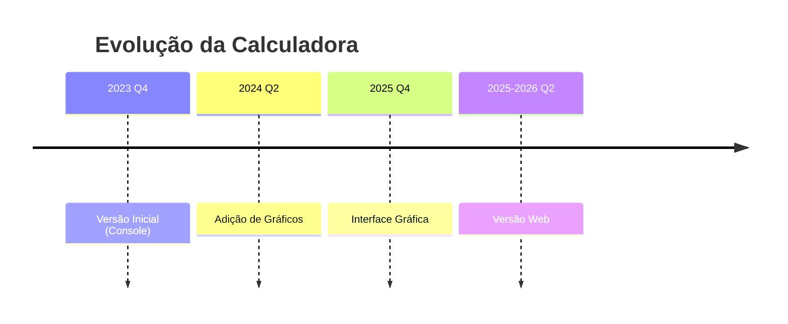

# 🧮 Calculadora Científica em Python

[]()
[]()
[]()
[](https://colab.research.google.com/drive/1hs5znm-lPc-AOodtHnrPCNhMBg8jakax)
[]()
[]()

Uma calculadora multifuncional para operações matemáticas básicas e avançadas, desenvolvida como projeto educacional em Python com interface intuitiva e histórico de cálculos.

## 📌 Índice

- [✨ Funcionalidades](#-funcionalidades)
- [🚀 Como Usar](#-como-usar)
- [🛠️ Tecnologias](#%EF%B8%8F-tecnologias)
- [🗺️ Roadmap](#%EF%B8%8F-roadmap)
- [📄 Licença](#-licença)
- [👨‍💻 Autor](#-autor)

## ✨ Funcionalidades

### 🔢 Operações Matemáticas
| Categoria           | Operações Disponíveis                          | 
|---------------------|-----------------------------------------------|
| **Básicas**         | Adição, Subtração, Multiplicação, Divisão     |
| **Potenciação**     | Expoentes, Raízes                             |
| **Álgebra**         | Equações 1º/2º grau, Fatorial, Logaritmos     |
| **Geometria**       | Teorema de Pitágoras, Trigonometria           |
| **Cálculo**         | Derivadas, Integrais                          |

### 📊 Visualização
- Geração de gráficos de funções
- Histórico de operações persistente

### 🔄 Conversões
- Temperatura (Celsius/Fahrenheit)
- Regra de três simples e inversa

### ℂ Números Complexos
- Operações básicas
- Forma polar
- Cálculo de raízes

## 🚀 Como Usar

```bash
# Clone o repositório
git clone https://github.com/LeoMedeiros72/Calculadora-3.0.git
cd Calculadora-3.0


# Instale as dependências
pip install -r requirements.txt

# Execute a calculadora
python calculadora.py
```
# Instruções:

Digite o número correspondente à operação desejada

Siga as instruções específicas de cada operação

Pressione Enter após cada entrada


      
## <span id="tecnologias">🛠️ Tecnologias</span>

<div align="center">     </div>

## <span id="roadmap">🗺️ Roadmap</span>

### ✅ Versão Atual (v3.0)


#Versão 3.0 - 2024-2025
- [x] ✅ Operações matemáticas básicas e avançadas
- [x] ✅ Suporte a números complexos
- [x] ✅ Sistema de histórico de cálculos
- [x] ✅ Números complexos
- [x] ✅ Geração de gráficos


### Próximas Versões 


**Próximos Passos Imediatos**:
1. [ ] 🖥️ Finalizar GUI (Previsão: Jul/2025)
2. [ ] 📦 Publicar no PyPI
3. [ ] 🧪 Testes E2E

<details> <summary>📊 Métricas Detalhadas</summary>


</details>

**Longo Prazo**:
- [ ] **v4.5**: Integração com Jupyter Notebooks
- [ ] **v5.0**: Versão Web (Streamlit/Dash)
- [ ] **v5.5**: Pacote PyPI com CLI avançado
- [ ] **v6.0**: Versão Mobile (Kivy)

<details> <summary>📊 Métricas de Progresso (Clique para expandir)</summary>
  

</details>


# 📅 Linha do Tempo Visual



- **v3.5 (Jul 2025)**  
  ✅ Interface gráfica básica  
  🏗️ Sistema de plugins

- **v4.0 (Dez 2025)**  
  🔜 Cálculo matricial  
  ⏳ Exportação LaTeX

## 📂 Licença

Este projeto está licenciado sob a licença MIT. Veja o arquivo [LICENSE](LICENSE) para mais detalhes.

## <span id="autor">👨‍💻 Autor</span>

<div align="center">
  
  
  **Leonardo Medeiros**  
  *Matemático Especialista, Cientista e Analista de Dados Sênior com especialização em IA e Machine Learning*

  <div style="margin: 20px 0; display: flex; justify-content: center; gap: 12px; flex-wrap: wrap;">
    <a href="https://github.com/LeoMedeiros72" target="_blank" title="GitHub">
      
    </a>
    <a href="https://www.linkedin.com/in/leonardo-medeiros-43556b211/" target="_blank" title="LinkedIn">
      
    </a>
    <a href="https://instagram.com/LeoMedeiros72" target="_blank" title="Instagram">
      
    </a>
    <a href="mailto:xorao.lsm@gmail.com" target="_blank" title="E-mail">
      
    </a>
  </div>

  <div style="margin-top: 10px;">
    <a href="https://github.com/LeoMedeiros72/Calculadora-3.0/stargazers" target="_blank">
      
    </a>
    <a href="https://github.com/LeoMedeiros72/Calculadora-3.0/network/members" target="_blank">
      
    </a>
  </div>

  <sub style="display: block; margin-top: 20px; color: #586069;">Criado com ❤️ e Python</sub>
</div>
