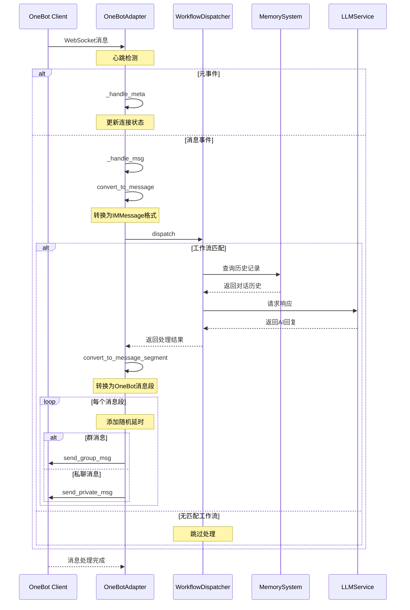

# OneBot-adapter for ChatGPT-Mirai-QQ-Bot

本项目是 [ChatGPT-Mirai-QQ-Bot](https://github.com/lss233/chatgpt-mirai-qq-bot) 的一个插件，用于将OneBot协议的消息转换为ChatGPT-Mirai-QQ-Bot的消息格式。

## 安装

```bash
pip install chatgpt-mirai-qq-bot-onebot-adapter
```

## 使用

在 `config.yaml` 中的 `ims` 中添加以下内容：

```yaml
ims:
  enable:
    onebot: ['onebot']
    ... # 其他IM配置
  configs:
    onebot:
      host: '0.0.0.0'             # OneBot服务器地址
      port: '5545'                # OneBot服务器端口
      access_token: ''            # OneBot服务器访问令牌
      heartbeat_interval: '15'    # 心跳间隔(秒)
    ... # 其他IM配置
```

## 项目工作原理


## 开源协议

本项目基于 [ChatGPT-Mirai-QQ-Bot](https://github.com/lss233/chatgpt-mirai-qq-bot) 开发，遵循其 [开源协议](https://github.com/lss233/chatgpt-mirai-qq-bot/blob/master/LICENSE)

## 感谢

感谢 [ChatGPT-Mirai-QQ-Bot](https://github.com/lss233/chatgpt-mirai-qq-bot) 的作者 [lss233](https://github.com/lss233) 提供框架支持

感谢 [AIOCQHTTP](https://github.com/nonebot/aiocqhttp) 的作者 [nonebot](https://github.com/nonebot) 提供CQHTTP协议支持

