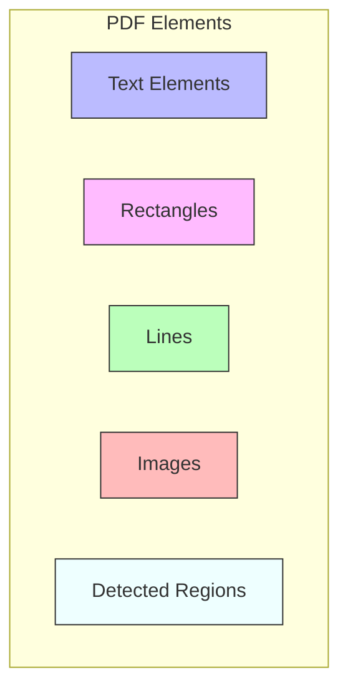

# Finding Elements in PDFs

Natural PDF uses CSS-like selectors to find elements in PDFs. This helps you pinpoint exactly what you're looking for in a document.

## Selector Structure

A Natural PDF selector is made up of these parts:

```
text[size>=12][color~=red]:bold:contains('Summary')
```

- `text` - Element type (text, rect, line, etc.)
- `[size>=12][color~=red]` - Attributes with operators
- `:bold:contains('Summary')` - Pseudo-classes

## Types of Elements on a Page



## The Basics: Finding Text

Let's start with the most common task: finding text in a PDF.

```python
from natural_pdf import PDF

pdf = PDF('document.pdf')
page = pdf.pages[0]

# Find the first occurrence of "Revenue"
revenue = page.find('text:contains("Revenue")')
if revenue:
    print(f"Found Revenue at position {revenue.bbox}")

# Find all occurrences
all_revenue = page.find_all('text:contains("Revenue")')
print(f"Found {len(all_revenue)} occurrences of Revenue")
```

## CSS-like Selectors

Natural PDF uses selectors that will feel familiar if you know CSS:

```python
# Find bold text
bold_text = page.find('text:bold')

# Find large text (12pt or bigger)
headings = page.find_all('text[size>=12]')

# Find bold text that's at least 14pt and contains "Summary"
summary = page.find('text[size>=14]:bold:contains("Summary")')

# Find colored text using color names
red_text = page.find_all('text[color~=red]')
blue_text = page.find_all('text[color~=blue]')
# Also supports RGB values if needed
dark_red_text = page.find_all('text[color~=(0.8,0,0)]')

# Find thick lines
thick_lines = page.find_all('line[width>=2]')
```

### Selector Operators

Natural PDF supports various operators for attribute matching:

Here's what each operator does:

| Operator | Description | Example | Use Case |
|----------|-------------|---------|----------|
| `=` | Exact match | `[fontname='Arial']` | When you need exact matching |
| `>=` | Greater than or equal | `[size>=12]` | Finding larger text (headings) |
| `<=` | Less than or equal | `[size<=8]` | Finding smaller text (footnotes) |
| `>` | Greater than | `[width>0.5]` | Finding elements above a threshold |
| `<` | Less than | `[height<2]` | Finding elements below a threshold |
| `~=` | Approximate match | `[color~=red]` | Color matching (supports names, RGB, hex) |
| `*=` | Contains substring | `[fontname*=Times]` | Partial string matching |

### Filtering by Source

Elements generated by OCR or Layout Analysis have a `source` attribute you can filter on:

```python
# Find text generated only by OCR
ocr_text = page.find_all('text[source=ocr]')

# Find regions detected by layout analysis
layout_regions = page.find_all('region[source=detected]')

# Find table regions specifically from the 'yolo' model
yolo_tables = page.find_all('region[source=detected][model=yolo][type=table]')
```

## Element Types

You can select different types of elements:

```python
# Find text elements
text = page.find_all('text')

# Find rectangle elements (often used for backgrounds or borders)
rects = page.find_all('rect')
# You can also filter rectangles by properties like fill color if available
# colored_rects = page.find_all('rect[fill_color~=blue]')

# Find line elements
lines = page.find_all('line')
# Filter lines by properties like width
thick_lines = page.find_all('line[linewidth>=1.5]') # Example: find lines thicker than 1.5 points

# Find curve elements
curves = page.find_all('curve')

# Find image elements
images = page.find_all('image')
```

## Advanced Text Searching

For more flexible text searches:

```python
# Case-insensitive search
results = page.find_all('text:contains("annual report")', case=False)

# Regular expression search
# Find all dates in format YYYY-MM-DD
dates = page.find_all('text:contains("\\d{4}-\\d{2}-\\d{2}")', regex=True)

# Combine options
page.find_all('text:contains("summary")', regex=True, case=False)
```

## Spatial Pseudo-Classes

Find elements based on their spatial relationship to other elements:

```python
# Find the title element first
title = page.find('text:contains("Report Title")')

# Find any text elements physically below the title
elements_below = page.find_all('text:below("text:contains(\'Report Title\')")')

# Find any text elements physically above the title
elements_above = page.find_all('text:above(":contains(\'Report Title\')")') # Type defaults to text

# Find lines to the left of the title
lines_left = page.find_all('line:left-of(":contains(\'Report Title\')")')

# Find rectangles near the title (within default distance)
rects_near = page.find_all('rect:near(":contains(\'Report Title\')")')

# Note: The inner selector identifies the *reference* element.
```

## Selecting Multiple Elements with ElementCollection

When you use `find_all()`, you get an `ElementCollection`. This collection provides helpful methods for working with groups of elements:

```python
# Find all headings
headings = page.find_all('text[size>=14]:bold')

# Get the first or last element in the collection (based on reading order)
first_heading = headings.first
last_heading = headings.last

# Get the physically highest/lowest/leftmost/rightmost element
# Note: These raise ValueError if elements span multiple pages
highest_heading = headings.highest()
lowest_heading = headings.lowest()

# Filter the collection further using another selector
important_headings = headings.filter('text:contains("Financial")')

# Extract text from all elements in the collection
all_heading_text = headings.extract_text()

# Sort the collection (e.g., by vertical position, then horizontal)
headings.sort(key=lambda el: (el.top, el.x0))

# Highlight all elements in the collection
headings.highlight(color="red", label="Headings") # Adds persistent highlights

# Show a temporary preview image of just these elements
preview_image = headings.show() # Displays in Jupyter
```

> **Note:** Directional properties like `.highest()`, `.lowest()`, `.leftmost()`, and `.rightmost()` on an `ElementCollection` will raise a `ValueError` if the collection contains elements from more than one page.

## Font Properties and Variants

You can select text based on font properties:

```python
# Find text with a specific font
arial_text = page.find_all('text[fontname*=Arial]')

# Find bold or italic text
bold_text = page.find_all('text:bold')
italic_text = page.find_all('text:italic')

# Find text with specific size
big_text = page.find_all('text[size>=16]')
small_text = page.find_all('text[size<=8]')

# Find text with specific font variant
# (PDFs often use prefixes like 'AAAAAB+' in font names)
variant_text = page.find_all('text[font-variant="AAAAAB"]')

# Combine font attributes
important_text = page.find_all('text[font-variant="AAAAAB"][size>=12]:bold')
```

> **Note:** The `:bold` and `:italic` pseudo-classes (and corresponding element properties) often rely on heuristics based on font naming conventions (e.g., checking if 'Bold' or 'Italic' is part of the `fontname` or `real_fontname`). This is generally reliable but might not be 100% accurate for all PDFs or fonts.

For a deep dive into PDF fonts, see the [Understanding PDF Fonts](../explanations/pdf-fonts.md) guide.

## Element Navigation Methods

Once you've found an element, you can navigate to related elements:

```python
# Find a starting element
element = page.find('text:contains("Introduction")')

# Get the next element in reading order
next_element = element.next()  # Next element regardless of type
next_text = element.next('text')  # Next text element
next_bold = element.next('text:bold', limit=20)  # Next bold text within 20 elements

# Get the previous element in reading order
prev_element = element.prev()  # Previous element regardless of type
prev_heading = element.prev('text[size>=12]')  # Previous large text

# Find the nearest element by Euclidean distance
nearest_element = element.nearest('rect')  # Nearest rectangle
nearest_with_limit = element.nearest('text:contains("Table")', max_distance=100)
```

These navigation methods generally operate based on reading order or proximity and can be combined with selectors to find specific types of neighbors.

## Next Steps

Now that you know how to find elements, try these topics:

- [Extracting Text](../text-extraction/index.md)
- [Working with Regions](../regions/index.md)
- [Visual Debugging](../visual-debugging/index.md)
- [PDF Extraction Challenges](../explanations/pdf-extraction-challenges.md)
- [Understanding PDF Fonts](../explanations/pdf-fonts.md)