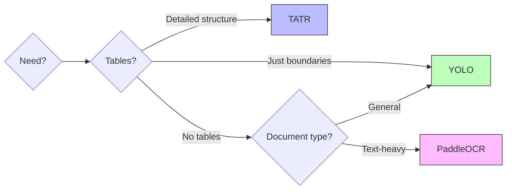

# Document Layout Analysis

Natural PDF includes document layout analysis capabilities that can automatically detect the structure of your documents, including headings, paragraphs, tables, and other elements.

## Layout Analysis Models Comparison

Natural PDF supports multiple layout analysis models:

| Feature | YOLO Model | PaddleOCR Layout | Table Transformer (TATR) |
|---------|------------|------------------|--------------------------|
| **Primary Focus** | General document structure | Text-oriented layout | Table structure |
| **Region Types** | 10+ types (titles, text, tables, figures, etc.) | 5 types (text, title, list, table, figure) | 4 types (table, row, column, header) |
| **Table Detection** | Detects tables as a unit | Detects tables as a unit | Detailed table structure |
| **Speed** | Fast | Medium | Slower |
| **OCR Integration** | Works independently | Integrated with PaddleOCR | Works independently |
| **Best For** | General document analysis | Text-heavy documents | Table extraction |
| **Default in Library** | Yes | No | No |

## Model Selection Guide



## Available Layout Models

Natural PDF supports multiple layout analysis models:

1. **YOLO** (default) - General document layout detection:
   - `title`: Document titles and headings
   - `plain-text`: Regular paragraph text
   - `table`: Tabular data
   - `figure`: Images and figures
   - `figure_caption`: Captions for figures
   - `table_caption`: Captions for tables
   - And several other specialized region types

2. **Table Transformer (TATR)** - Detailed table structure analysis:
   - `table`: The complete table
   - `table-row`: Individual rows
   - `table-column`: Individual columns
   - `table-column-header`: Column headers

## Basic Layout Analysis

To analyze the layout of a document:

```python
from natural_pdf import PDF

pdf = PDF('document.pdf')
page = pdf.pages[0]

# Analyze the layout
# Uses the default engine (currently YOLO)
# Requires natural-pdf[layout_yolo] for default
page.analyze_layout()

# Find all detected regions
regions = page.find_all('region')
print(f"Found {len(regions)} regions")

# Highlight all detected regions
page.highlight_layout()
page.save_image("layout_detection.png")
```

## Finding Specific Region Types

You can find specific types of regions:

```python
# Find titles/headings
titles = page.find_all('region[type=title]')

# Find paragraphs (plain text)
paragraphs = page.find_all('region[type=plain-text]')

# Find tables
tables = page.find_all('region[type=table]')

# Find figures
figures = page.find_all('region[type=figure]')
```

## Working with Layout Regions

Once you have detected regions, you can work with them like any other region:

```python
# Extract text from a table region
if tables:
    table = tables[0]
    table_text = table.extract_text()
    print(f"Table content: {table_text}")
    
    # Highlight the table
    table.highlight(color=(0, 0, 1, 0.2), label="Table")
    
    # Get all text elements within the table
    table_elements = table.find_all('text')
```

## Layout Models

Natural PDF supports multiple layout detection models:

```python
# Use the default engine (e.g., YOLO)
page.analyze_layout()

# Use the PaddleOCR layout model (if available)
page.analyze_layout(engine="paddle")

# Use the Table Transformer model (if available)
page.analyze_layout(engine="tatr")
```

## Controlling Detection Confidence

You can control the confidence threshold for detection:

```python
# Use a higher confidence threshold for more reliable detections
page.analyze_layout(engine="yolo", confidence=0.5)

# Use a lower threshold to detect more regions
page.analyze_layout(engine="yolo", confidence=0.2)
```

## Visualizing Layout Detection

You can visualize the detected layout:

```python
# Find detected regions first
page.analyze_layout()

# Show temporary preview, colored by region type
preview = page.find_all('region').show(group_by='type')
preview # Displays in Jupyter

# Alternatively, color-code persistent highlights by confidence level
high_conf = page.find_all('region[confidence>=0.8]')
med_conf = page.find_all('region[confidence>=0.5][confidence<0.8]')
low_conf = page.find_all('region[confidence<0.5]')

high_conf.highlight(color="green", label="High Confidence")
med_conf.highlight(color=(1, 1, 0, 0.3), label="Medium Confidence")
low_conf.highlight(color=(1, 0, 0, 0.3), label="Low Confidence")

# View the persistent highlights
page.viewer()
```

## Table Structure Detection

The TATR (Table Transformer) model can detect detailed table structure:

```python
# Analyze table structure
page.analyze_layout(engine="tatr")

# Find table structure elements
tables = page.find_all('region[type=table]')
rows = page.find_all('region[type=table-row]')
columns = page.find_all('region[type=table-column]')
headers = page.find_all('region[type=table-column-header]')

# Highlight table structure
tables.highlight(color=(0, 0, 1, 0.2), label="Tables")
rows.highlight(color=(1, 0, 0, 0.2), label="Rows")
columns.highlight(color=(0, 1, 0, 0.2), label="Columns")
headers.highlight(color=(0.5, 0, 0.5, 0.2), label="Headers")

# Save the visualization
page.save_image("table_structure.png", labels=True)
```

## Combined Layout Analysis

You can combine multiple models for more comprehensive analysis:

```python
# Find regions generated by a specific engine using the 'model' attribute
yolo_regions = page.find_all('region[model=yolo]')
tatr_regions = page.find_all('region[model=tatr]')

# Show preview colored by model engine
page.find_all('region').show(group_by='model')
```

## OCR + Layout Analysis

For scanned documents, you can combine OCR with layout analysis:

```python
# Enable OCR
pdf = PDF('scanned_document.pdf', ocr=True)
page = pdf.pages[0]

# Apply OCR first
page.apply_ocr()

# Then analyze layout
page.analyze_layout()

# Find text in detected regions
title_region = page.find('region[type=title]')
if title_region:
    title_text = title_region.extract_text()
    print(f"Title: {title_text}")
```

## Region Attributes

Layout regions have additional attributes you can access:

```python
region = page.find('region')
if region:
    # Get region type and confidence
    region_type = region.type
    confidence = region.confidence
    model = region.model
    
    # Print region info
    print(f"Region type: {region_type}, Confidence: {confidence:.2f}, Model: {model}")
```

## Region Images

You can extract images of detected regions:

```python
# Find a table region
table = page.find('region[type=table]')
if table:
    # Extract an image of just the table
    table_image = table.to_image(resolution=150)
    table.save_image("table.png")
```

## Table Structure Detection

For detailed table analysis, use the Table Transformer (TATR) model:

```python
# Analyze table structure
page.analyze_layout(engine="tatr")

# Find table components
tables = page.find_all('region[type=table]')
rows = page.find_all('region[type=table-row]')
columns = page.find_all('region[type=table-column]')
headers = page.find_all('region[type=table-column-header]')

# Highlight the table structure
tables.highlight(color="blue", label="Tables")
rows.highlight(color="red", label="Rows")
columns.highlight(color="green", label="Columns")
headers.highlight(color="purple", label="Headers")

# Extract the table data
if tables:
    table_data = tables[0].extract_table(method="tatr")
    print(table_data)
```

For more details on table extraction, visit the [Tables documentation](../tables/index.md).

## Parameter Tuning Guide

The right confidence threshold improves results:

| Document Type | Recommended Confidence | Notes |
|---------------|------------------------|-------|
| Clean, well-structured | 0.5 - 0.7 | Higher threshold for cleaner results |
| Average quality | 0.3 - 0.5 | Balance between coverage and accuracy |
| Poor quality/scanned | 0.2 - 0.3 | Lower threshold to catch more regions |
| Mixed content | 0.3 | Good general-purpose starting point |

## Next Steps

With layout analysis, you can:

- [Extract tables](../tables/index.md) from your documents
- [Ask questions](../document-qa/index.md) about specific regions
- [Work with regions](../regions/index.md) for more precise extraction
- [Learn about PDF extraction challenges](../explanations/pdf-extraction-challenges.md)