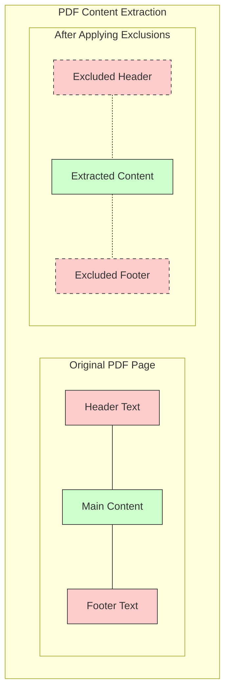

# Text Extraction

Extracting text from PDFs is one of the most common tasks with Natural PDF. This section covers different approaches to text extraction, from basic to advanced.

## Basic Text Extraction

The simplest way to extract text is to use the `extract_text()` method:

```python
from natural_pdf import PDF

pdf = PDF('document.pdf')
page = pdf.pages[0]

# Extract all text from a page
text = page.extract_text()
print(text)

# Extract text from the entire document
all_text = pdf.extract_text()
```

## Extracting Text from Specific Elements

You can extract text from specific elements:

```python
# Find a specific element
title = page.find('text:contains("Summary")')
if title:
    # Get just that element's text
    title_text = title.text
    print(f"Title: {title_text}")
    
# Find multiple elements and extract their text
headings = page.find_all('text[size>=14]:bold')
headings_text = headings.extract_text()
```

## Multi-Word Searches

Natural PDF has enhanced support for multi-word searches:

```python
# Search for elements containing full phrases
annual_report = page.find('text:contains("Annual Report")')

# Case-insensitive search
financial_statement = page.find('text:contains("financial statement")', case=False)

# Regular expression search
year_report = page.find('text:contains("\\d{4}\\s+Report")', regex=True)

# Combining options
summary = page.find('text:contains("executive summary")', regex=True, case=False)
```

The multi-word search feature works because Natural PDF preserves spaces in text elements by default. You can control this behavior:

```python
# Keep spaces (default behavior)
pdf = PDF('document.pdf', keep_spaces=True)

# Legacy behavior (break at spaces)
pdf = PDF('document.pdf', keep_spaces=False)
```

## Extracting Text from Regions

You can extract text from specific regions of a page:

```python
# Create a region and extract text from it
title = page.find('text:contains("Introduction")')
content = title.below()
intro_text = content.extract_text()

# Extract text from a region between elements
start = page.find('text:contains("Method")')
end = page.find('text:contains("Results")')
method_section = start.below(until='text:contains("Results")', include_until=False)
method_text = method_section.extract_text()

# Create a region manually
region = page.create_region(100, 200, 500, 600)  # x0, top, x1, bottom
region_text = region.extract_text()
```

## Filtering Out Headers and Footers

A common challenge with PDF extraction is filtering out headers and footers. Natural PDF makes this easy with exclusion zones:

```python
# Define header and footer as exclusion zones
header = page.find('text:contains("Confidential")').above()
page.add_exclusion(header)

footer = page.find('text:contains("Page")').below()
page.add_exclusion(footer)

# Now extract text without headers and footers
clean_text = page.extract_text()  # Exclusions are applied by default

# You can also disable exclusions if needed
full_text = page.extract_text(apply_exclusions=False)

# Add exclusions at the PDF level that apply to all pages
pdf.add_exclusion(
    lambda page: page.find('text:contains("Confidential")').above(),
    label="header"
)
pdf.add_exclusion(
    lambda page: page.find_all('line')[-1].below(),
    label="footer"
)

# Now extract text from the entire document without headers/footers
clean_text = pdf.extract_text()
```

### Optimized Exclusion Handling

Natural PDF uses smart region exclusion handling for better performance:

```python
# Create a region that intersects with header exclusion
header_excl = page.add_exclusion(page.find('text:contains("HEADER")').above())
middle_region = page.create_region(50, page.height * 0.25, page.width - 50, page.height * 0.75)

# Extract text - will automatically use efficient cropping for header exclusion
middle_text = middle_region.extract_text()
```

The system automatically chooses the best exclusion strategy:
- No intersection with exclusions: exclusions are ignored entirely
- Header/footer exclusions: uses efficient cropping approach
- Complex exclusions: uses element filtering with a warning

## Controlling Whitespace

You can control how whitespace is handled during extraction:

```python
# Keep blank characters (default)
text = page.extract_text(keep_blank_chars=True)

# Remove blank characters
text = page.extract_text(keep_blank_chars=False)

# Extract with original whitespace preserved
text = page.extract_text(preserve_whitespace=True)  # Alias for keep_blank_chars
```

## Font-Aware Text Extraction

Natural PDF groups characters into words based on font attributes to preserve formatting:

```python
# Default: Group by font name and size
pdf = PDF("document.pdf")  # Default: font_attrs=['fontname', 'size']

# Spatial only: Group only by position
pdf = PDF("document.pdf", font_attrs=[])

# Custom: Group by font name, size, and color
pdf = PDF("document.pdf", font_attrs=['fontname', 'size', 'non_stroking_color'])
```

This helps preserve text formatting during extraction: changes in font attributes break words, so different styles remain separate.

### Font Information Access

You can access detailed font information for any text element:

```python
element = page.find('text')
print(element)  # Shows font name, size, style, etc.
print(element.font_info())  # Shows all available font properties

# Check text style properties
if element.bold:
    print("This is bold text")
if element.italic:
    print("This is italic text")

# Get font name and size
font_name = element.fontname
font_size = element.size

# Find elements with specific font attributes
arial_text = page.find_all('text[fontname*=Arial]')
big_text = page.find_all('text[size>=14]')
```

## Working with Font Styles

Natural PDF can group text by font style, which helps with identifying headings, body text, etc.:

```python
# Analyze text styles on the page
text_styles = page.analyze_text_styles()

# Extract text from a specific style
if "Text Style 1" in text_styles:
    heading_style = text_styles["Text Style 1"]
    headings_text = heading_style.extract_text()
    
# Visualize the text styles
page.highlight_text_styles()
page.save_image("text_styles.png")

# Combine with highlight_all
page.highlight_all(include_text_styles=True)
```

### Working with Font Variants

Some PDFs use font variants (with prefixes like 'AAAAAB+') to distinguish visually different text:

```python
# Find text with a specific font variant
variant_text = page.find_all('text[font-variant="AAAAAB"]')

# Filter by both font variant and other attributes
bold_variant = page.find_all('text[font-variant="AAAAAB"][size>=10]:bold')
```

## Reading Order

Text extraction respects the natural reading order of the document (top-to-bottom, left-to-right by default):

```python
# Extract with default reading order
text = page.extract_text()

# Get elements in reading order to process manually
elements = page.find_all('text')  # Already sorted in reading order
for element in elements:
    print(element.text)
```

## Element Navigation

You can navigate between elements in reading order:

```python
# Find the next element in reading order
element = page.find('text:contains("Introduction")')
next_element = element.next()  # Next element regardless of type
next_text = element.next('text')  # Next text element
next_bold = element.next('text:bold', limit=20)  # Next bold text within 20 elements

# Find the previous element in reading order
prev_element = element.prev()  # Previous element regardless of type
prev_heading = element.prev('text[size>=12]')  # Previous large text

# Find the nearest element by Euclidean distance
nearest_element = element.nearest('rect')  # Nearest rectangle
nearest_with_limit = element.nearest('text:contains("Table")', max_distance=100)  # Within 100 points
```

## Working with OCR Text

For scanned documents, you can extract text using OCR:

```python
# Enable OCR when opening the PDF
pdf = PDF('scanned_document.pdf', ocr=True)

# Extract text with OCR
text = page.extract_text()  # OCR applied automatically

# Force OCR even if text is present
ocr_text = page.extract_text(ocr=True)

# Find and extract only OCR text
ocr_elements = page.find_all('text[source=ocr]')
ocr_only_text = ocr_elements.extract_text()

# Filter OCR elements by confidence
high_confidence = page.find_all('text[source=ocr][confidence>=0.8]')
```

## Complete Text Extraction Example

Here's a complete example that demonstrates various text extraction techniques:

```python
from natural_pdf import PDF
import re

# Open a PDF with text extraction options
pdf = PDF(
    "document.pdf",
    keep_spaces=True,  # Enable multi-word searches
    font_attrs=["fontname", "size", "bold", "italic"]  # Font-aware text extraction
)

# Add document-wide exclusions for headers and footers
pdf.add_exclusion(
    lambda page: page.find('text:contains("Page")').below() if page.find('text:contains("Page")') else None,
    label="footers"
)

# Process the first page
page = pdf.pages[0]

# Analyze text styles
styles = page.analyze_text_styles()
print(f"Found {len(styles)} distinct text styles")

# Extract headings (largest text style)
largest_style = None
largest_size = 0
for style_name, elements in styles.items():
    if elements and hasattr(elements[0], 'size'):
        if elements[0].size > largest_size:
            largest_size = elements[0].size
            largest_style = elements

if largest_style:
    headings = largest_style
    print("Headings:")
    for heading in headings:
        print(f"  - {heading.text}")
    
    # Process sections under each heading
    for heading in headings:
        # Find the next heading or end of page
        next_heading = heading.next('text[size>={size}]'.format(size=largest_size-1))
        if next_heading:
            section = heading.below(until=next_heading, include_until=False)
        else:
            section = heading.below()
            
        print(f"\nSection: {heading.text}")
        section_text = section.extract_text()
        print(section_text[:200] + "..." if len(section_text) > 200 else section_text)
        
        # Find specific information with regex
        if "financial" in heading.text.lower():
            # Look for currency amounts
            amounts = re.findall(r'\$\d+(?:,\d+)*(?:\.\d+)?', section_text)
            if amounts:
                print("Found amounts:", amounts)

# Extract all text without headers/footers
print("\nFull document text (without headers/footers):")
all_text = pdf.extract_text()
print(all_text[:500] + "..." if len(all_text) > 500 else all_text)
```

## Excluding Headers and Footers

You can exclude specific regions of the page (like headers and footers) from text extraction:



```python
# Add exclusion zones
# Exclude header (top of page)
header = page.find('text:contains("Report Title")')
if header:
    page.add_exclusion(header.above())
    
# Exclude footer (bottom of page)
footer = page.find('text:contains("Page")')
if footer:
    page.add_exclusion(footer.below())
    
# Extract text without headers/footers
text = page.extract_text()  # Exclusions applied by default
text = page.extract_text(apply_exclusions=False)  # Ignore exclusions

# PDF-level exclusion with lambdas (applies to all pages)
pdf.add_exclusion(
    lambda page: page.find('text:contains("Header")').above() if page.find('text:contains("Header")') else None,
    label="headers"
)

pdf.add_exclusion(
    lambda page: page.find_all('line')[-1].below() if page.find_all('line') else None,
    label="footers"
)

# Extract text with exclusions
text = pdf.extract_text()
```

## Next Steps

Now that you know how to extract text, you might want to explore:

- [Working with regions](../regions/index.md) for more precise extraction
- [OCR capabilities](../ocr/index.md) for scanned documents
- [Document layout analysis](../layout-analysis/index.md) for automatic structure detection
- [Document QA](../document-qa/index.md) for asking questions directly to your documents