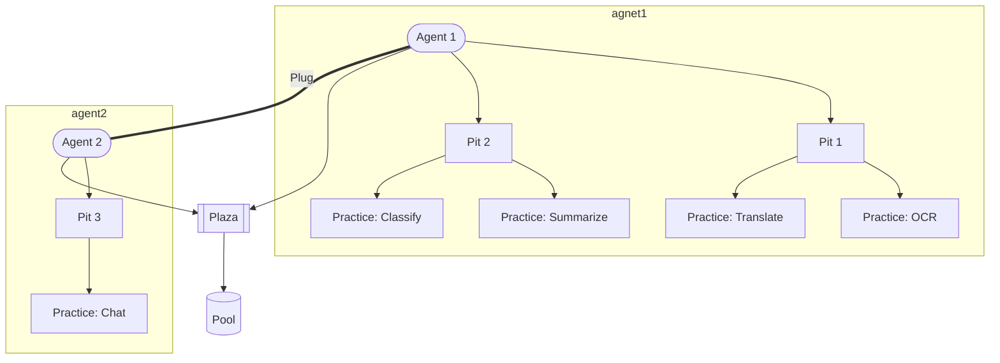
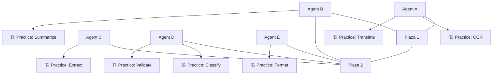

# Prompits
Prompits is a decentralized, modular framework designed to empower collaborative AI agents in executing and optimizing intelligent workflows. It supports flexible communication, distributed coordination, and evolutionary learning, making it ideal for automating complex, multi-step processes in a scalable and transparent way.

### Purpose

- Enable the creation and optimization of intelligent workflows using AI and human collaboration.
- Facilitate decentralized problem-solving across multiple agents with reusable skills (Practices).
- Support open experimentation and innovation with transparent evaluation and incentive mechanisms.

### Benefits

- Scalable and extensible architecture for distributed AI agents.
- Modular and composable components for building custom workflows.
- Decentralized discovery, evaluation, and coordination of skills and agents.
- Token-based economy (Pondo) for rewarding useful contributions and governing the system.

## Features

- Decentralized multi-agent collaboration
- Modular and extensible system architecture
- Graph-based and sequential workflow management
- AI-human hybrid optimization through Profiler and Pathway evaluations
- Token-based economy for governance and prioritization

## Core Concepts

Prompits is composed of modular components that work together to enable intelligent, decentralized multi-agent workflows. These components can be grouped into the following categories:

### 1. **Agents and Capabilities**
- **Pit** – The base agent that performs actions.
- **Practice** – The specific skill or function a Pit can perform.
- **Plug** – Enables communication between agents or with external systems.

**Relationship:** Each Pit has one or more Practices (skills) and communicates via Plugs.

### 2. **Workflow Structure**
- **Pathway** – A full workflow composed of steps (Posts).
- **Post** – A single step in a Pathway.
- **Planner** – Creates and organizes Pathways based on Proposals.
- **Pathfinder** – Executes Pathways by delegating Posts to agents.
- **Pioneer** – Explores and tests new Pathways or methods.

**Relationship:** Proposals are passed to the Planner, which builds a Pathway of Posts. The Pathfinder then assigns Posts to suitable Pits, and Pioneers can innovate new solutions.

### 3. **Coordination and Discovery**
- **Plaza** – A decentralized space for agents to advertise their capabilities and discover others.
- **Proposal** – A request or task needing a workflow.
- **Pact** – A formal agreement among agents on how to execute tasks.

**Relationship:** Agents use Plazas to coordinate and respond to Proposals. Pacts form the basis of collaboration.

### 4. **Data and Integration**
- **Pool** – A storage space for shared data or resources.
- **Pouch** – A database interface, acting as a specialized Pool for queries.

**Relationship:** Agents interact with Pools for reading and writing data. Pouches enable structured query access.

### 5. **Optimization and Incentives**
- **Profiler** – Scores and ranks agent performance, Practices, and Pathways.
- **Pondo** – Token system used for rewards, prioritization, and governance.
- **Pricing** – Mechanism for bidding on task execution using Pondo.

**Relationship:** Profiler tracks and ranks contributions. Pondo is earned or spent based on agent performance and pricing agreements.

## Agent Structure

In Prompits, an **Agent** can represent a higher-level container for multiple **Pits**, which are the active worker components. Each Pit in turn holds a set of **Practices**, which define the actions or capabilities the Pit can perform. This nested structure allows for scalability and modularity in managing agent behavior and task specialization.

- **Agent** – High-level container or identity and instance of Pits.
- **Pit** – Basic elements in Prompits.
- **Practice** – A defined skill or action a Pit can perform.
- **Plug** - Communication channel between agents.
- **Plaza** - Bulletin board for agents to advertise status
- **Pool** - Storage or memory

The diagram below illustrates this structure:



## Architecture Diagram

The diagram below shows how agents (Pits) interact with central discovery hubs called Plazas. Each agent is connected to one or more Plazas, which serve as decentralized communication spaces for coordination and collaboration. Around each agent, various Practices represent the skills or capabilities they offer.

- **Plaza 1 and Plaza 2** sit at the center of the system, connecting agents together.
- **Agents A to E** represent intelligent workers capable of performing tasks.
- **Practices** (e.g., OCR, Translate, Classify) are modular functions that agents can execute.
- This layout emphasizes a decentralized, collaborative system where agents can discover, cooperate, and evolve through shared tasks.



## Installation

```bash
git clone https://github.com/alvincho/prompits.git
cd prompits/python-sdk
pip install -r requirements.txt
```

## Usage

Start a basic agent:
```bash
python create-agent.py --config agent1.json --refresh
```

You can also configure agents via the `agent.json` file or extend functionality by adding new Practices or Pathways.

## Contributing

Contributions are welcome! Please open an issue or submit a pull request. See [CONTRIBUTING.md](CONTRIBUTING.md) for details.

## License

This project is licensed under the MIT License. See the [LICENSE](LICENSE) file for more information.

## Disclaimer

⚠️ **This project is currently in the Proof-of-Concept (PoC) stage.**  
It is intended for developer review, experimentation, and early feedback only.

- Do not use this system in production environments.
- APIs, architecture, and components are subject to significant change.
- Contributions and suggestions are highly welcome as the project evolves.

## Roadmap

Curious about where Prompits is headed? Check out the [ROADMAP.md](../ROADMAP.md) for a detailed view of upcoming phases, features, and milestones.
