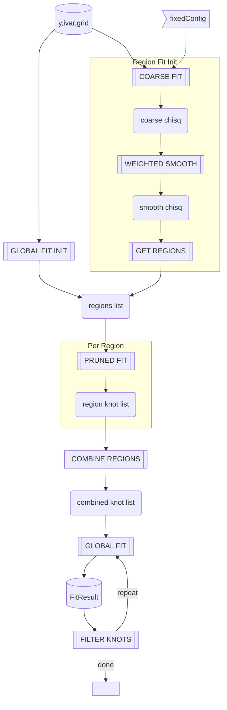

```mermaid
flowchart TD

  INPUT[(y,ivar,grid)]

  fixedConfig>fixedConfig]
  fixedConfig -.-> COARSE_FIT

  subgraph "Region Fit Init"
    COARSE_FIT[["COARSE FIT"]]
    coarse_chisq("coarse chisq")
    WEIGHTED_SMOOTH[["WEIGHTED SMOOTH"]]
    smooth_chisq("smooth chisq")
    GET_REGIONS[["GET REGIONS"]]

    COARSE_FIT --> coarse_chisq
    coarse_chisq --> WEIGHTED_SMOOTH
    WEIGHTED_SMOOTH --> smooth_chisq
    smooth_chisq --> GET_REGIONS
  end

  GLOBAL_INIT[["GLOBAL FIT INIT"]]
  INPUT --> GLOBAL_INIT
  INPUT --> COARSE_FIT
  GLOBAL_INIT --> regions_list

  regions_list("regions list")
  GET_REGIONS --> regions_list
  regions_list --> PRUNED_FIT

  %% Per region group
  subgraph "Per Region"
    PRUNED_FIT[["PRUNED FIT"]]
    region_knot_list("region knot list")

    PRUNED_FIT --> region_knot_list
  end

  COMBINE_REGIONS[["COMBINE REGIONS"]]
  combined_knot_list("combined knot list")
  region_knot_list --> COMBINE_REGIONS
  COMBINE_REGIONS --> combined_knot_list

  %% Final step
  GLOBAL_FIT[["GLOBAL FIT"]]
  FitResult[("FitResult")]
  FILTER_KNOTS[["FILTER KNOTS"]]

  combined_knot_list --> GLOBAL_FIT
  GLOBAL_FIT --> FitResult
  FitResult --> FILTER_KNOTS
  FILTER_KNOTS -- repeat --> GLOBAL_FIT
  FILTER_KNOTS -- done --> END[" "]
```
