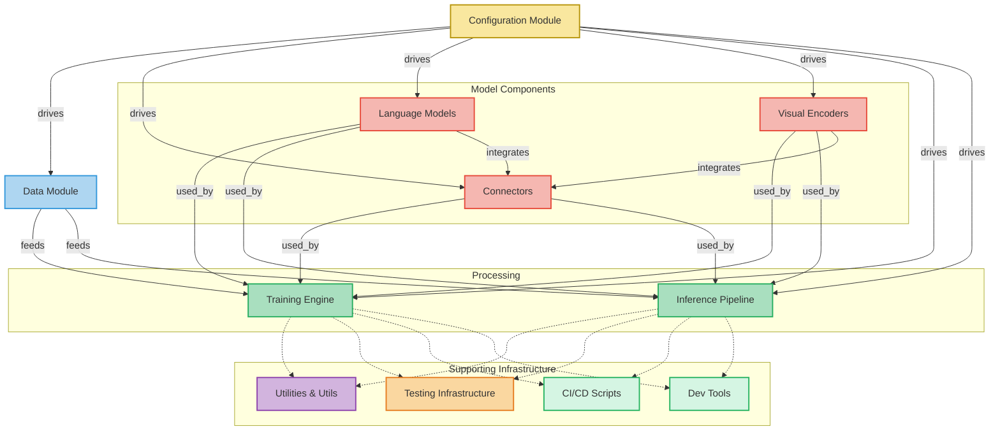

# small-vlm

this is small-vlm used for experiments.

## Project Structure

---

## Installing uv and Python

This project is set up to use [**uv**](https://docs.astral.sh/uv/), the new package
manager for Python. `uv` replaces traditional use of `pyenv`, `pipx`, `poetry`, `pip`,
etc. This is a quick cheat sheet on that:

On macOS or Linux, if you don't have `uv` installed, a quick way to install it:

```shell
curl -LsSf https://astral.sh/uv/install.sh | sh
```

For macOS, you prefer [brew](https://brew.sh/) you can install or upgrade uv with:

```shell
brew update
brew install uv
```

See [uv&#39;s docs](https://docs.astral.sh/uv/getting-started/installation/) for more
installation methods and platforms.

Now you can use uv to install a current Python environment:

```shell
uv python install 3.13 # Or pick another version.
```

## Development Workflows

For development workflows, see [development.md](development.md).

For instructions on publishing to PyPI, see [publishing.md](publishing.md).

---

*This project was built from
[simple-modern-uv](https://github.com/jlevy/simple-modern-uv).*
