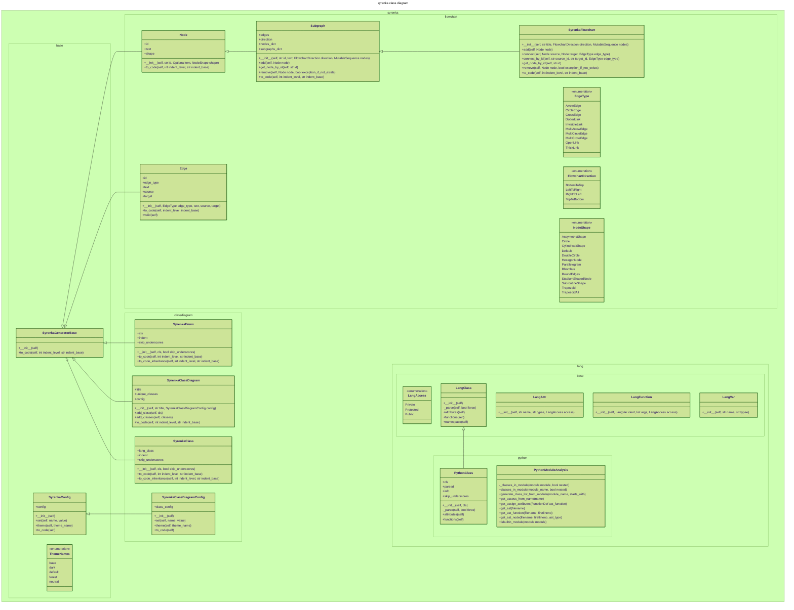

# syrenka
syrenka is mermaid markdown generator

## Description

The aim of this project is to provide easy to use classes for generating mermaid charts and diagrams.

## Installation

`pip install syrenka`

## Example

Here are current classes in syrenka module:

<!-- EX1_MERMAID_DIAGRAM_BEGIN -->

<!-- EX1_MERMAID_DIAGRAM_END -->

So how do we get it?
This is a code snippet that does it:

<!-- EX1_SYRENKA_CODE_BEGIN -->
```python
from syrenka.classdiagram import SyrenkaClassDiagram, SyrenkaClassDiagramConfig
from syrenka.base import ThemeNames
from syrenka.lang.python import PythonModuleAnalysis

class_diagram = SyrenkaClassDiagram(
    "syrenka class diagram", SyrenkaClassDiagramConfig().theme(ThemeNames.forest)
)
class_diagram.add_classes(
    PythonModuleAnalysis.classes_in_module(module_name="syrenka", nested=True)
)

for line in class_diagram.to_code():
    print(line)
```
<!-- EX1_SYRENKA_CODE_END -->

and the output:
<!-- EX1_MERMAID_DIAGRAM_RAW_BEGIN -->
```cmd
---
title: syrenka class diagram
config:
  theme: forest
  class:
    hideEmptyMembersBox: true
---
classDiagram
namespace syrenka.classdiagram{
    class SyrenkaClass{
        +lang_class
        +indent
        +skip_underscores
        +\_\_init\_\_(self, cls, bool skip_underscores)
        +to_code(self, int indent_level, str indent_base)
        +to_code_inheritance(self, int indent_level, str indent_base)
    }
    class SyrenkaClassDiagram{
        +title
        +unique_classes
        +config
        +\_\_init\_\_(self, str title, SyrenkaClassDiagramConfig config)
        +add_class(self, cls)
        +add_classes(self, classes)
        +to_code(self, int indent_level, str indent_base)
    }
    class SyrenkaClassDiagramConfig{
        +class_config
        +\_\_init\_\_(self)
        +set(self, name, value)
        +theme(self, theme_name)
        +to_code(self)
    }
    class SyrenkaEnum{
        +cls
        +indent
        +skip_underscores
        +\_\_init\_\_(self, cls, bool skip_underscores)
        +to_code(self, int indent_level, str indent_base)
        +to_code_inheritance(self, int indent_level, str indent_base)
    }
}
namespace syrenka.flowchart{
    class SyrenkaFlowchart{
        +\_\_init\_\_(self, str title, FlowchartDirection direction, MutableSequence nodes)
        +add(self, Node node)
        +connect(self, Node source, Node target, EdgeType edge_type)
        +connect_by_id(self, str source_id, str target_id, EdgeType edge_type)
        +get_node_by_id(self, str id)
        +remove(self, Node node, bool exception_if_not_exists)
        +to_code(self, int indent_level, str indent_base)
    }
    class Edge{
        +id
        +edge_type
        +text
        +source
        +target
        +\_\_init\_\_(self, EdgeType edge_type, text, source, target)
        +to_code(self, indent_level, indent_base)
        +valid(self)
    }
    class EdgeType{
        <<enumeration>>
        ArrowEdge
        CircleEdge
        CrossEdge
        DottedLink
        InvisibleLink
        MultiArrowEdge
        MultiCircleEdge
        MultiCrossEdge
        OpenLink
        ThickLink
    }
    class FlowchartDirection{
        <<enumeration>>
        BottomToTop
        LeftToRight
        RightToLeft
        TopToBottom
    }
    class Node{
        +id
        +text
        +shape
        +\_\_init\_\_(self, str id, Optional text, NodeShape shape)
        +to_code(self, int indent_level, str indent_base)
    }
    class NodeShape{
        <<enumeration>>
        AssymetricShape
        Circle
        CylindricalShape
        Default
        DoubleCircle
        HexagonNode
        Parallelogram
        Rhombus
        RoundEdges
        StadiumShapedNode
        SubroutineShape
        Trapezoid
        TrapezoidAlt
    }
    class Subgraph{
        +edges
        +direction
        +nodes_dict
        +subgraphs_dict
        +\_\_init\_\_(self, str id, text, FlowchartDirection direction, MutableSequence nodes)
        +add(self, Node node)
        +get_node_by_id(self, str id)
        +remove(self, Node node, bool exception_if_not_exists)
        +to_code(self, int indent_level, str indent_base)
    }
}
namespace syrenka.lang.base{
    class LangAccess{
        <<enumeration>>
        Private
        Protected
        Public
    }
    class LangAttr{
        +\_\_init\_\_(self, str name, str typee, LangAccess access)
    }
    class LangClass{
        +\_\_init\_\_(self)
        -_parse(self, bool force)
        +attributes(self)
        +functions(self)
        +namespace(self)
    }
    class LangFunction{
        +\_\_init\_\_(self, LangVar ident, list args, LangAccess access)
    }
    class LangVar{
        +\_\_init\_\_(self, str name, str typee)
    }
}
namespace syrenka.lang.python{
    class PythonClass{
        +cls
        +parsed
        +info
        +skip_underscores
        +\_\_init\_\_(self, cls)
        -_parse(self, bool force)
        +attributes(self)
        +functions(self)
    }
    class PythonModuleAnalysis{
        -_classes_in_module(module module, bool nested)
        +classes_in_module(module_name, bool nested)
        +generate_class_list_from_module(module_name, starts_with)
        +get_access_from_name(name)
        +get_assign_attributes(FunctionDef ast_function)
        +get_ast(filename)
        +get_ast_function(filename, firstlineno)
        +get_ast_node(filename, firstlineno, ast_type)
        +isbuiltin_module(module module)
    }
}
namespace syrenka.base{
    class SyrenkaGeneratorBase{
        +\_\_init\_\_(self)
        +to_code(self, int indent_level, str indent_base)
    }
    class SyrenkaConfig{
        +config
        +\_\_init\_\_(self)
        +set(self, name, value)
        +theme(self, theme_name)
        +to_code(self)
    }
    class ThemeNames{
        <<enumeration>>
        base
        dark
        default
        forest
        neutral
    }
}
%% inheritance
SyrenkaGeneratorBase <|-- SyrenkaClass
SyrenkaGeneratorBase <|-- SyrenkaClassDiagram
SyrenkaConfig <|-- SyrenkaClassDiagramConfig
SyrenkaGeneratorBase <|-- SyrenkaEnum
Subgraph <|-- SyrenkaFlowchart
SyrenkaGeneratorBase <|-- Edge
SyrenkaGeneratorBase <|-- Node
Node <|-- Subgraph
LangClass <|-- PythonClass
```
<!-- EX1_MERMAID_DIAGRAM_RAW_END -->

ready to use mermaid markdown
