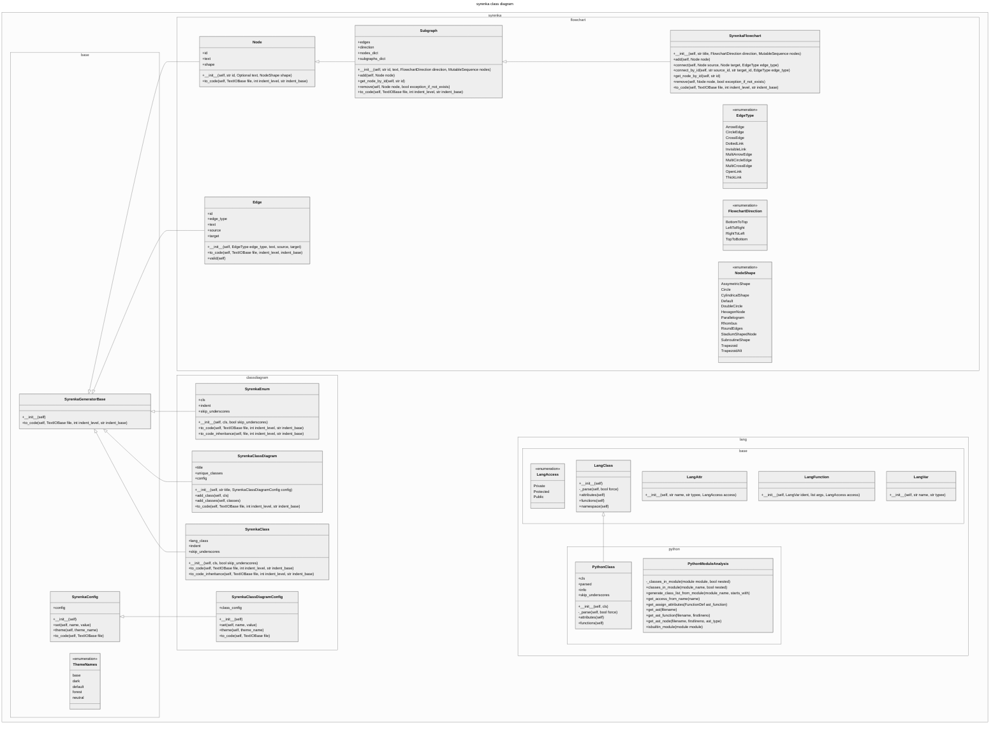
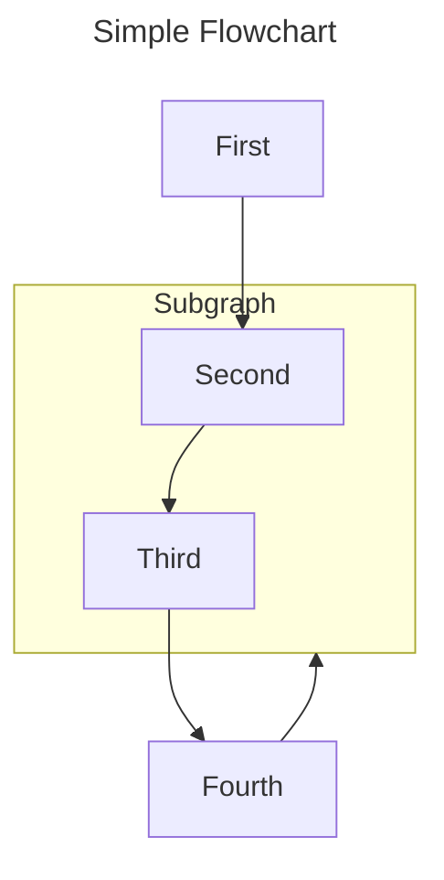

# syrenka
syrenka is mermaid markdown generator

## Description

The aim of this project is to provide easy to use classes for generating mermaid charts and diagrams.

## Installation

`pip install syrenka`

## Example

### SyrenkaClassDiagram
Here are current classes in syrenka module:

<!-- EX1_MERMAID_DIAGRAM_BEGIN -->

<!-- EX1_MERMAID_DIAGRAM_END -->

So how do we get it?
This is a code snippet that does it:

<!-- EX1_SYRENKA_CODE_BEGIN -->
```python
from syrenka.classdiagram import SyrenkaClassDiagram, SyrenkaClassDiagramConfig
from syrenka.base import ThemeNames
from syrenka.lang.python import PythonModuleAnalysis

# from io import StringIO
import sys

class_diagram = SyrenkaClassDiagram(
    "syrenka class diagram", SyrenkaClassDiagramConfig().theme(ThemeNames.neutral)
)
class_diagram.add_classes(
    PythonModuleAnalysis.classes_in_module(module_name="syrenka", nested=True)
)

# file can be anything that implements TextIOBase
# out = StringIO() # string buffer in memory
out = sys.stdout  # stdout
# out = open("syrenka.md", "w") # write it to file

class_diagram.to_code(file=out)

# StringIO
# out.seek(0)
# print(out.read())
```
<!-- EX1_SYRENKA_CODE_END -->

### SyrenkaFlowchart

Here is the simple flowchart:

<!-- EX2_MERMAID_DIAGRAM_BEGIN -->

<!-- EX2_MERMAID_DIAGRAM_END -->

and the code behind it:

<!-- EX2_SYRENKA_CODE_BEGIN -->
```python
import syrenka.flowchart as sf
import sys

fl = sf.SyrenkaFlowchart(
    title="Simple Flowchart", direction=sf.FlowchartDirection.TopToBottom
)
fl.add(sf.Node(id="1", text="First"))
sub = sf.Subgraph(id="s", text="Subgraph")
sub.add(sf.Node(id="2", text="Second"))
sub.add(sf.Node(id="3", text="Third"))
fl.add(sub)
fl.add(sf.Node(id="4", text="Fourth"))

fl.connect_by_id("1", "2")
fl.connect_by_id(source_id="2", target_id="3", edge_type=sf.EdgeType.DottedLink)
fl.connect_by_id("3", "4").connect_by_id("4", "s", sf.EdgeType.ThickLink)

fl.to_code(file=sys.stdout)
```
<!-- EX2_SYRENKA_CODE_END -->
